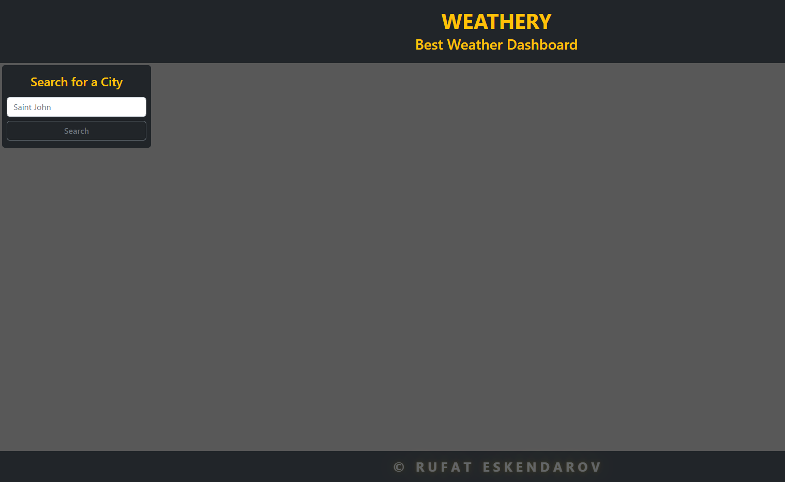
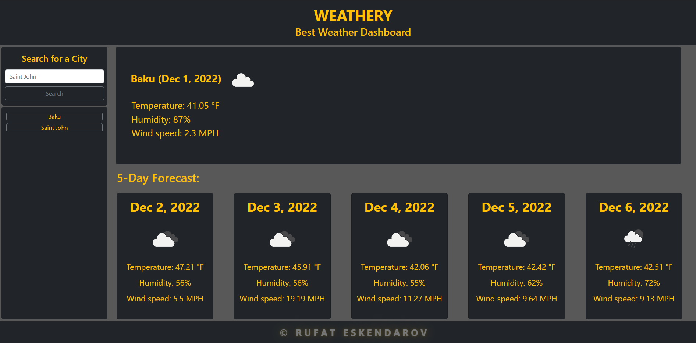

# WEATHERY

## Description

This project was created to practice and improve knowledge of Bootstrap and 3rd party APIs. Also, the files with the code of this project are great as a tutorial for beginner developers.

Repository: [repo](https://github.com/RufatEskendarov/Weathery)

WebApp: [webapp](https://rufateskendarov.github.io/Weathery/)

## User Story:

AS A traveler
I WANT to see the weather outlook for multiple cities
SO THAT I can plan a trip accordingly

## Acceptance Criteria:

- GIVEN a weather dashboard with form inputs;
- WHEN I search for a city
  THEN I am presented with current and future conditions for that city and that city is added to the search history;
- WHEN I view current weather conditions for that city
  THEN I am presented with the city name, the date, an icon representation of weather conditions, the temperature, the humidity, and the the wind speed ;
- WHEN I view future weather conditions for that city
  THEN I am presented with a 5-day forecast that displays the date, an icon representation of weather conditions, the temperature, the wind speed, and the humidity;
- WHEN I click on a city in the search history
  THEN I am again presented with current and future conditions for that city;

## Installation

This application does not require installation, just follow the link:[webapp](https://rufateskendarov.github.io/Weathery/v)

## Usage

1. By clicking on the web application link above, you will see a form with a search button..(Screen-1);
2. By entering the name in the search bar and clicking the "Search" button, you will download the weather forecast for the current day, and the weather forecast for the next 5 days will be downloaded below. Also, the name of the city you were looking for will be saved below under the search form. By clicking on the name of the city that you later viewed, you can reload the weather forecast for it.(Screen-2);

## License

In accordance with https://choosealicense.com/licenses/gpl-3.0/

## Features

- HTML5
- CSS3
- JavaScript
- DOM manipulations
- Bootstrap
- 3rd party APIs

## How to Contribute

Please review my page if you have ideas or advises please contact me (rufat.eskendarov@gmail.com)

## Tests

Manual testing was carried out on the application, no errors or bugs were found. If you encounter problems while using the app, please contact me (rufat.eskendarov@gmail.com).
